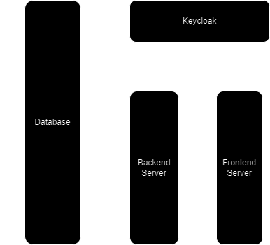
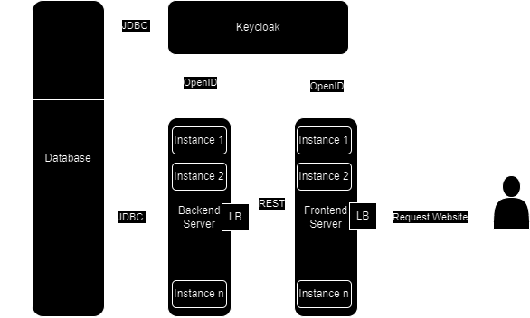

# Welcome to Obesta Demo!

This is a project to create a software solution for an online business.
This consists mainly of thoughts and suggestions,
it does not involve any details of the Obesta business process.

This project is inspired by the Obesta software accessible under <https://obesta.at> (WIP). 

# Problem

Imagine you have a good idea for a e-commerce business.
And your idea needs a software that offers various services for their users.
The software should be:
- easily-accessible on all devices
- highly-automated for sending requests and responses
- have business-guided processes for guiding users
- have adjustable-sortiment for different regions
- and so on ...

But it should also be on budget to limit the costs and time during development.

This can already be a challenge to fulfil all needs. Additionally, you need to take the software characteristics like reliability, maintainibility, ... into account to achieve a high software quality.

# Proposed Solution

The problem can be broken down into smaller challenges that need to be overcome.
For a website, we need a frontend server that can be accessed on all devices, provides business information, products and guides for users.
To separate the business logic from the frontend, we additionally need a backend server for automating processes and workflows. 
To store the data of various products, we can use a database and to host all our servers we need to select a cloud service, except you want it host locally.

For my approach, I also use an authentication server to speed up the development by using a keycloak server (view https://www.keycloak.org/).

Note: The authentication server gets a scheme in the database to store its non-business data. 

## Technology Stack

I recommend reviewing various technologies before choosing one.
Check whether the technology can meet future requirements.
Avoid using abandoned technologies such as Jakarta Server Faces (JSF).

For example, my choices were:
- Frontend - Angular, Material
- Backend - Java, Springboot, Maven
- DB - PostgreSql
- Cloud Service - AWS

## Architecture Overview

The proposed architecture is designed to meet the requirements of functionality, security, and scalability.

### Functionality
To ensure the functionality, the communication between the servers needs to be defined.
Keycloak offers seamless integration with **OpenID Connect** (OIDC), that is the best fit for the task.
Between frontend and backend, it is good fit to use **REST** API's.
For the database, we use JDBC.

### Security

To avoid any exploitation, the traffic needs to be controlled or limited.
Firstly, the **REST** API's can contain sensitive functions that should be restricted to authorized users only.
To achieve that, we can use **JWT Tokens**, provided by keycloak, to authorize requests to the backend server.
Secondly, the architecture can be placed inside a **VPC** (Virtual Private Cloud) to limit the access on the servers.
For that, we define gateways to allow controlled requests to the servers.
Lastly, it is advisable to use HTTPS Encryption.

### Scalability

The load on the servers can vary over time.
The cloud service provides additional options to make servers scalable.
In **AWS** you can use an **AWS Elastic Beanstalk** to achieve the scalability with multiple instances combined with a load balancer
(view https://aws.amazon.com/elasticbeanstalk/).

Note: LB is short for load balancer.
The green boxes represent the gateway accessible from the internet.

## Servers

For the proposed architecture, there will be four servers in total needed.

### Database

The database can be provided by [Amazon Relational Database Service](https://aws.amazon.com/rds/).
It requires very little configuration for a database with a backup.
The main work consists of designing the database schema to ensure integrity.
Depending on the business idea, consider different situations where data needs to be deleted, anonymized or expanded.
It is easier to expand the database schema then to simply changing it.

### Keycloak

You can use the dockerized Keycloak to run it on [Amazon Elastic Container Service](https://aws.amazon.com/ecs/).
Follow the instructions on https://www.keycloak.org/guides to secure the backend and frontend server and to
configure the database connection. 

Note that Keycloak provides **Single-Sign On** (**SSO**), which is not recommended for the us of only one application such as the solution proposed above. 

### Backend Server

The backend server acts as a resource server in the architecture,
responsible for handling business logic,
data manipulation,
and executing various workflows to support the functionality of the platform.
The backend server exposes a set of RESTful APIs that allow the frontend application to interact with it
and perform CRUD (Create, Read, Update, Delete) operations on resources.

For example, look at the project inside the folder named **backend-demo**.

### Frontend Server

The frontend server serves as the client-facing component responsible for rendering the user interface and interacting with users.
It delivers the client-side application, which includes HTML, CSS, and JavaScript files responsible for rendering the user interface and providing interactivity
based on the data received from the backend server through RESTful APIs.

It is very useful to first define the look and content of the website
using a user interface drawing tool such as Adobe XD or Figma to achieve a coherent design for the entire website.

# Conclusion

In conclusion, the proposed solution offers a comprehensive approach to address the challenges of developing an platform while meeting the requirements of functionality, security, and scalability.
By breaking down the problem into smaller challenges and leveraging a combination of technologies, the solution provides a solid foundation for building a robust and reliable software solution.

Overall, with careful planning, thoughtful consideration of technologies, and adherence to security and scalability principles,
the project has the potential to succeed in the competitive landscape of e-commerce.
However, it's important to note that this is just the first barrier to overcome.
The development of the solution needs to continue for the backend and frontend servers, adapting them to the specific needs and intricacies of the business in a fine-grained level.
Continuous iteration, refinement, and adaptation will be essential to ensure that the e-commerce platform evolves to meet the ever-changing demands of the market and the users it serves.

As such, this project can serve as inspiration for entrepreneurs and developers embarking on their own software ventures, providing valuable insights and guiding principles for planning and executing successful software solutions.