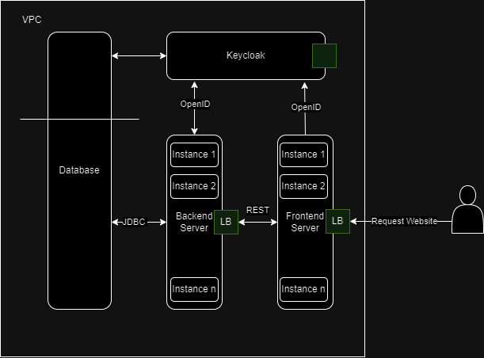

# Welcome to Obesta Demo!

This is a tutorial to create a software solution for an online business.
The tutorial consists mainly of thoughts and suggestions,
it does not involve any details of the Obesta business process.

This project is inspired by the Obesta software accessible under <obesta.at>. 

## Problem

Imagine you have a good idea for a e-commerce business.
And your idea needs a software that offers various services for their users.
The software should be:
- easily-accessible on all devices
- highly-automated for sending requests and responses
- have business-guided processes for guiding users
- have adjustable-sortiment for different regions
- and so on ...

But it should also be on budget to limit the costs and time during development.

This can already be a challenge to fulfil all needs. Additionally, you need to take the software characteristics like reliability, maintainibility, ... into account to achieve a high software quality.

## Solution

The problem can be broken down into smaller challenges that need to be overcome.
For a website, we need a frontend server that can be accessed on all devices, provides business information, products and guides for users.
To separate the business logic from the frontend, we additionally need a backend server for automating processes and workflows. 
To store the data of various products, we can use a database and to host all our servers we need to select a cloud service.

For my approach, I also use an authentication server to speed up the development by using a keycloak server (view https://www.keycloak.org/).

Note: The authentication server gets a scheme in the database to store its non-business data. 

### Technology Stack

I recommend reviewing various technologies before choosing one.
Check whether the technology can meet future requirements.
Avoid using abandoned technologies such as Jakarta Server Faces (JSF).

For example, my choices were:
- Frontend - Angular, Material
- Backend - Java, Springboot, Maven
- DB - PostgreSql
- Cloud Service - AWS

### Architecture

The communication needs to be defined between the server.
Also, take in consideration to use load balancers to make the backend & frontend servers scalable.

For the connections to the Keycloak we can use **OpenID**. **OpenID** is easy to configure and secured.
For communication between frontend and backend, REST API's are a good fit.

Note: LB is short for load balancer.
In **AWS** you can use an **AWS Elastic Beanstalk** to achieve the scalability with multiple instances
(view https://aws.amazon.com/elasticbeanstalk/).

